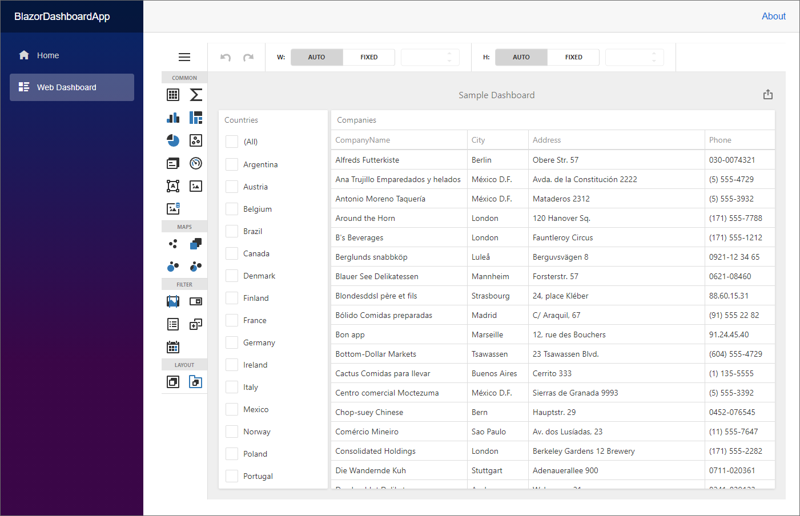

<!-- default badges list -->

<!-- default badges end -->
# Dashboard for Blazor Server - Get Started

The project demonstrates how you can incorporate a DevExpress Dashboard component into a [Blazor Server](https://docs.microsoft.com/en-us/aspnet/core/blazor/hosting-models?view=aspnetcore-6.0#blazor-server) application. Use it as a template when you need to create a similar web application. The example applies to framework .NET 6.

The Dashboard component wraps the JavaScript [DashboardControl](https://docs.devexpress.com/Dashboard/js-DevExpress.Dashboard.DashboardControl) and uses an ASP.NET Core backend withthe Dashboard Controller to handle client data requests.

## Files to Look At

* [Program.cs](./CS/BlazorDashboardApp/Program.cs)
* [Dashboard.razor](./CS/BlazorDashboardApp/Pages/Dashboard.razor)

## Documentation

- [Create a Blazor Server Dashboard Application](https://docs.devexpress.com/Dashboard/403029)

## More Examples

- [Dashboard Blazor Server App - Configuration](https://github.com/DevExpress-Examples/dashboard-blazor-server-configuration)
- [Dashboard Blazor Server App - JavaScript Customization](https://github.com/DevExpress-Examples/dashboard-blazor-server-js-customization)
- [Dashboard Component in Blazor WebAssembly Application](https://github.com/DevExpress-Examples/dashboard-blazor-webassembly-app)

